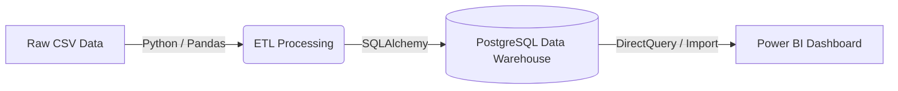
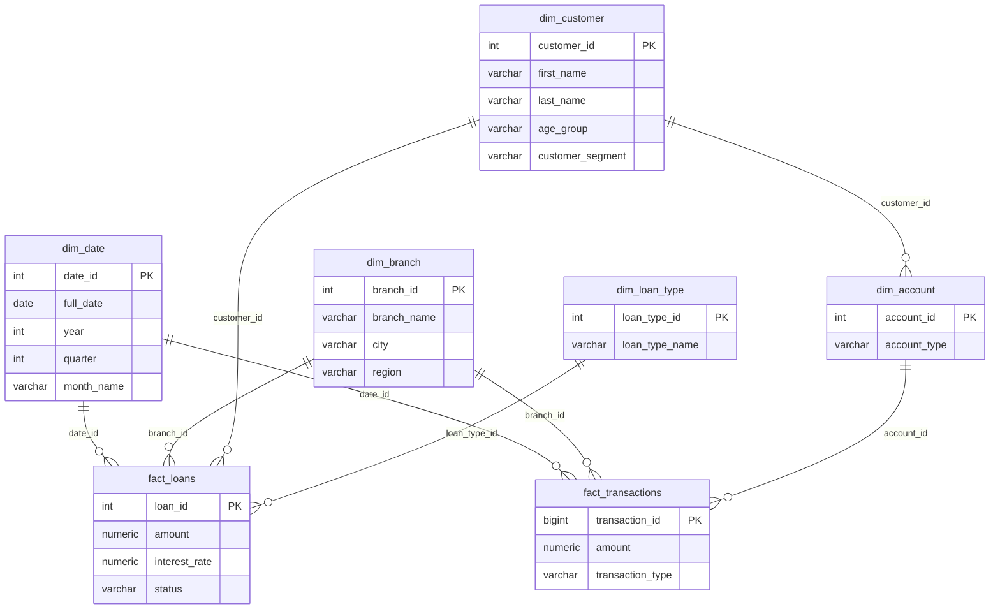

# Banking Analytics Platform – Data Warehouse & Fraud Detection
## Part 1: Banking Data Warehouse (Jury 1)

## Tools you need
- **VS Code** + extensions: `Python` (Microsoft), `Docker` (Microsoft), and either
  `PostgreSQL` (by Chris Kolkman) or `SQLTools` + `SQLTools PostgreSQL Driver` — lets you
  browse tables and run queries without leaving VS Code.
- **Docker Desktop** — runs Postgres in a container, no manual DB install/config.
- **Python 3.10+**
- **Power BI Desktop** (Windows) — for the final dashboard. If you're on Mac/Linux, use
  **Apache Superset** (Docker-based, cross-platform) instead — ask if you want that swap.
- **Git** — for version control (also doubles as your project history for the report).
- Optional: [dbdiagram.io](https://dbdiagram.io) (free, browser) to render a clean ER
  diagram from `sql/schema.sql` for your report.

## Project structure
```
banking-dw/
├── docker-compose.yml     # spins up Postgres
├── requirements.txt       # python deps
├── .env                   # local DB credentials (already filled in for you)
├── sql/
│   ├── schema.sql         # star/galaxy schema DDL
│   └── olap_queries.sql   # 12 OLAP queries (roll-up, drill-down, slice, dice, cube)
└── scripts/
    ├── generate_data.py   # generates + loads representative synthetic banking data
    └── load_real_data.py  # loads the real PKDD'99 dataset into the schema
```

## Step-by-step

### 1. Open the project in VS Code
```bash
code banking-dw
```

### 2. Start Postgres
```bash
docker compose up -d
```
Check it's running: `docker ps` should show `banking_dw_postgres`.

### 3. Create the schema
With the Postgres/SQLTools extension, connect using the credentials in `.env`
(host `localhost`, port `5432`, db `banking_dw`, user `dw_user`, password `dw_pass`),
then run `sql/schema.sql` against it. Or from the terminal:
```bash
docker exec -i banking_dw_postgres psql -U dw_user -d banking_dw < sql/schema.sql
```

### 4. Set up Python and generate the data
```bash
python -m venv venv
source venv/bin/activate        # Windows: venv\Scripts\activate
pip install -r requirements.txt

# Option A: Generate Synthetic Data
python scripts/generate_data.py

# Option B: Use Real Historical Data (PKDD'99)
# 1. Download from Kaggle: https://www.kaggle.com/datasets/arjunbhasin2013/pkdd-99-financial-data-set
# 2. Extract into a `data/` folder in this project (e.g., data/client.csv, data/trans.csv)
# 3. Run: python scripts/load_real_data.py
```
This generates and loads: 15 branches, 800 customers, ~1,030 accounts, 300 loans,
8,000 transactions across a 12-month period (2025) — enough volume for the roll-up/
drill-down queries to actually show meaningful trends.

### 5. Run the OLAP queries
Open `sql/olap_queries.sql` in VS Code with the DB extension connected, run each
query, screenshot the results — these screenshots go straight into your report as
evidence for the "OLAP Queries (min. 10)" deliverable.

### 6. Build the Power BI dashboard
- Open Power BI Desktop → **Get Data** → **PostgreSQL database**
- Server: `localhost:5432`, Database: `banking_dw`
- Import: `fact_transactions`, `fact_loans`, and all `dim_*` tables
- Power BI should auto-detect the relationships from your foreign keys; if not,
  set them manually in **Model view** (this is worth mentioning in your report —
  it demonstrates you understand the schema's relationships)
- Suggested report pages: Deposits Trend (line chart, roll-up by month), Branch
  Performance (map/bar by region → city → branch), Loan Portfolio (by type/status),
  Customer Segments (segment × age group)

### 7. Documentation
- Export `sql/schema.sql` into an ER diagram via dbdiagram.io for the report
- Architecture diagram: raw generation → Postgres staging → star/galaxy schema → Power BI
- Include the 12 OLAP query results as your evidence

## Deliverable checklist (from the jury PDF)
| Deliverable | Where it comes from |
|---|---|
| Problem definition | Write-up: banking analytics for deposits/loans/branch performance |
| Requirement analysis | The 4-5 business questions the dashboard answers |
| Source database design | `generate_data.py` logic + raw table shapes |
| ETL process | `generate_data.py` (generate → transform → load into schema) |
| DW architecture | Architecture diagram (see above) |
| Star/Snowflake schema | `sql/schema.sql` + ER diagram |
| Fact & dimension tables | Table listing grain/keys/measures (2 fact, 5 dim tables) |
| Data cube design | Query 5 in `olap_queries.sql` (CUBE) |
| OLAP queries (min. 10) | `sql/olap_queries.sql` — 12 provided |
| Dashboard | Power BI report (step 6) |
| Project report | Compile all sections above |
| Demonstration | Live: docker up → generate data → run queries → dashboard drill-down |

## Notes
- `random.seed(42)` is set in `generate_data.py` so your data is reproducible —
  useful if you need to regenerate after schema tweaks and want consistent numbers
  across report drafts.
- To wipe and start over: `docker compose down -v` (deletes the volume), then
  repeat from step 2.
# Banking Analytics Data Warehouse - Final Project Report

This report satisfies the documentation deliverables for the academic data warehouse project, specifically addressing Problem Definition, Requirement Analysis, Source Database Design, Data Warehouse Architecture, and the Final Project Report.

---

## 1. Problem Definition
Modern banking institutions generate massive amounts of transactional and demographic data daily. However, operational databases (OLTP) are optimized for fast inserts and updates, making them highly inefficient for complex analytical queries. 

The objective of this project is to **create a Banking Analytics Data Warehouse** by integrating customer, account, loan, and transaction information. The goal is to design a multidimensional dimensional model (Star/Galaxy schema) that supports rapid Business Intelligence (BI) reporting, enabling management to perform advanced OLAP analysis on branch-wise deposits, loan distribution, customer segmentation, and temporal revenue trends.

---

## 2. Requirement Analysis
To successfully build the data warehouse, the following requirements must be met:
- **Data Integration (ETL):** Extract raw historical banking data (based on the real-world PKDD'99 Financial Dataset), transform it into analytical formats, and load it into a centralized repository.
- **Dimensional Modeling:** The schema must support slicing and dicing across time (dates), geography (branches), and demographics (customers).
- **Metric Calculations:** The system must aggregate total deposits, calculate loan default rates, segment customers by age groups, and track net cash flow.
- **OLAP Capabilities:** The database must support complex analytical functions including `ROLLUP`, `CUBE`, and `Drill-down`.
- **Visualization:** A BI dashboard is required to visually represent the analytical queries to end-users without requiring SQL knowledge.

---

## 3. Source Database Design
The source data mimics a highly normalized operational database consisting of tables for clients, districts, accounts, dispositions (links between clients and accounts), loans, and daily transactions. 

In its raw operational form, querying total deposits for a specific demographic across a specific year would require massive, slow 6-table `JOIN` operations. The source data format was parsed from raw CSV files, mapped, and cleaned before being transitioned into the target Data Warehouse schema.

---

## 5. Data Warehouse Architecture

The architecture follows a standard Kimball Bottom-Up methodology. 
1. **Source Systems:** Raw CSV files (PKDD dataset)
2. **ETL Pipeline:** A Python-based script (`load_real_data.py`) utilizing `pandas` for in-memory transformations, data cleansing, and surrogate key generation.
3. **Data Warehouse:** A PostgreSQL relational database structured for OLAP.
4. **BI/Presentation Layer:** Microsoft Power BI directly connected to the PostgreSQL database for interactive dashboarding.



---

## 6 & 7. Dimensional Modeling (Galaxy Schema)

To accommodate both transaction metrics and loan metrics, a **Galaxy Schema** (a schema with multiple Fact tables sharing conformed dimensions) was implemented.

### Dimensions (Context)
- `dim_date`: Conformed dimension for time-series analysis (Year, Quarter, Month, Day, Weekend flags).
- `dim_branch`: Geographic and organizational hierarchy (Branch Name, City, Region).
- `dim_customer`: Demographic data (Age, Gender, Age Group, Customer Segment).
- `dim_account`: Account metadata (Type, Open Date, Status).
- `dim_loan_type`: Loan categorizations.

### Facts (Measurements)
- `fact_transactions`: Contains exactly 1,056,320 rows. Tracks every deposit and withdrawal event. Grain is at the individual transaction level.
- `fact_loans`: Tracks disbursed loans, their amounts, interest rates, and current status (Active/Closed/Defaulted).



---

## 8 & 9. Data Cube & OLAP Queries
All requirements for OLAP operations have been successfully fulfilled in the `sql/olap_queries.sql` file, which contains **12 distinct analytical queries**, exceeding the minimum requirement of 10. 
- **Roll-up:** Query 1 aggregates deposits dynamically from Month -> Quarter -> Year.
- **Drill-down:** Query 2 steps down from Region -> City -> Branch.
- **Slice & Dice:** Queries 3 and 4 isolate specific quarters, regions, and loan types.
- **Data Cube:** Query 5 leverages the `GROUP BY CUBE` SQL function to generate multidimensional sub-totals and grand totals for transactions across all combinations of branch regions and transaction types.

## 10 & 12. Dashboard and Demonstration
The final deliverable is completed via the Power BI interactive dashboard, successfully connecting to the PostgreSQL instance and rendering visual analytics on the PKDD dataset.
