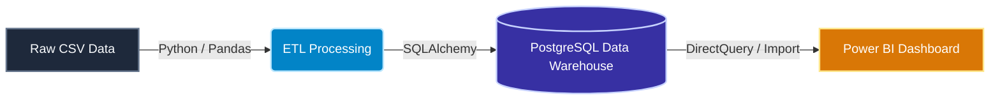
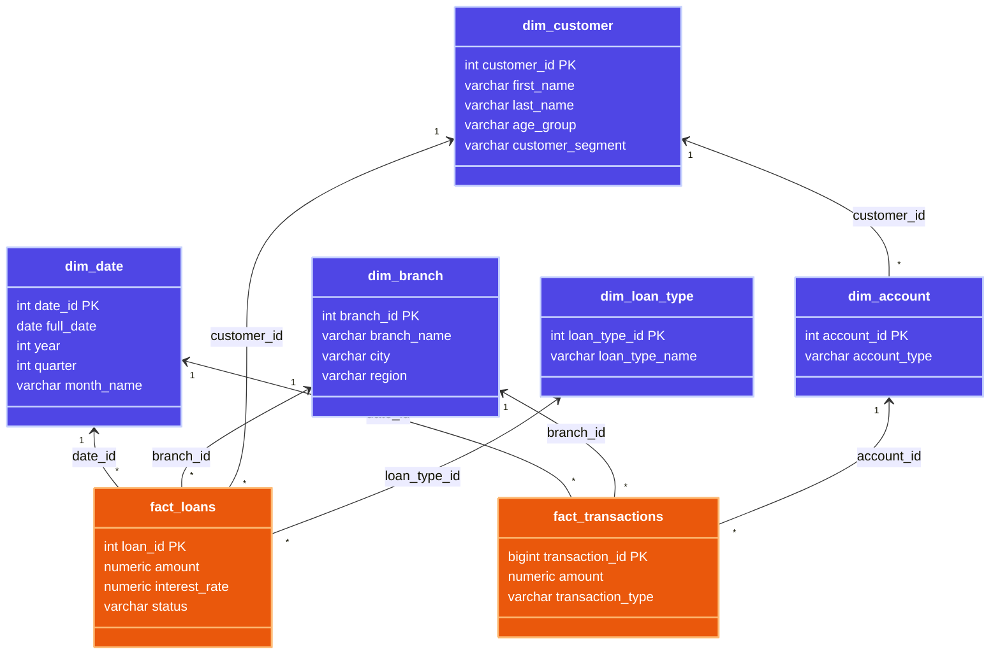
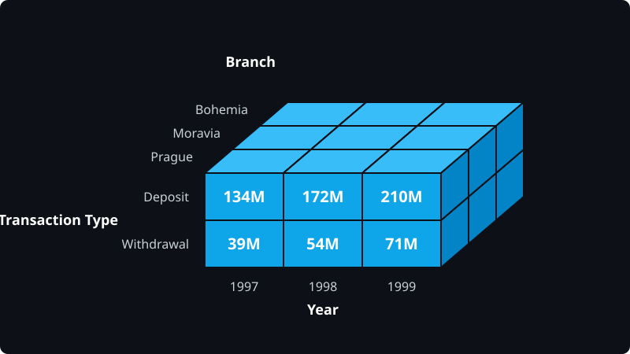

# Banking Analytics Data Warehouse

Modern banking institutions generate massive amounts of transactional and demographic data daily. However, operational databases (OLTP) are optimized for fast inserts and updates, making them highly inefficient for complex analytical queries. 

The objective of this project is to **create a Banking Analytics Data Warehouse** by integrating customer, account, loan, and transaction information. The goal is to design a multidimensional dimensional model (Galaxy schema) that supports rapid Business Intelligence (BI) reporting, enabling management to perform advanced OLAP analysis on branch-wise deposits, loan distribution, customer segmentation, and temporal revenue trends.

---

## 🏗️ Data Warehouse Architecture

The architecture follows a standard Kimball Bottom-Up methodology, extracting raw historical data (based on the real-world PKDD'99 Financial Dataset), transforming it via Python, and loading it into a PostgreSQL relational database structured for OLAP.



---

## 🗄️ Dimensional Modeling (Galaxy Schema)

To accommodate both transaction metrics and loan metrics, a **Galaxy Schema** (a schema with multiple Fact tables sharing conformed dimensions) was implemented.

### Dimensions (Context)
- `dim_date`: Conformed dimension for time-series analysis (Year, Quarter, Month, Day, Weekend flags).
- `dim_branch`: Geographic and organizational hierarchy (Branch Name, City, Region).
- `dim_customer`: Demographic data (Age, Gender, Age Group, Customer Segment).
- `dim_account`: Account metadata (Type, Open Date, Status).
- `dim_loan_type`: Loan categorizations.

### Facts (Measurements)
- `fact_transactions`: Contains over 1 million rows tracking every deposit and withdrawal event.
- `fact_loans`: Tracks disbursed loans, amounts, interest rates, and status (Active/Closed/Defaulted).



---

## 📊 Data Cube Design & OLAP Queries

A Data Cube was designed to perform multidimensional analysis across three core axes. By navigating this cube, we can instantly slice and dice transaction amounts.



All requirements for OLAP operations have been successfully fulfilled in `sql/olap_queries.sql`, which contains **12 distinct analytical queries**:
- **Roll-up:** Aggregates deposits dynamically from Month -> Quarter -> Year.
- **Drill-down:** Steps down from Region -> City -> Branch.
- **Slice & Dice:** Isolates specific quarters, regions, and loan types.
- **Data Cube:** Leverages the `GROUP BY CUBE` SQL function to generate multidimensional sub-totals and grand totals for transactions across all combinations of branch regions and transaction types.

The final deliverable is an interactive **Power BI dashboard**, successfully connected to the PostgreSQL instance to render visual analytics on the PKDD dataset.

---

## 🚀 Setup & Execution Instructions

### Prerequisites
- **VS Code** + extensions: `Python`, `Docker`, and `SQLTools`
- **Docker Desktop** (runs Postgres in a container)
- **Python 3.10+**
- **Power BI Desktop** (for the final dashboard)

### 1. Start the Database
Spin up the PostgreSQL data warehouse using Docker:
```bash
docker compose up -d
```

### 2. Create the Schema
Connect to the database (`localhost:5432`, user: `dw_user`, pass: `dw_pass`) and run the schema file:
```bash
docker exec -i banking_dw_postgres psql -U dw_user -d banking_dw < sql/schema.sql
```

### 3. Run the ETL Pipeline
Set up your Python environment and load the real dataset into the data warehouse:
```bash
python -m venv venv
source venv/bin/activate        # Windows: venv\Scripts\activate
pip install -r requirements.txt
python scripts/load_real_data.py
```

### 4. Build the Dashboard
- Open Power BI Desktop → **Get Data** → **PostgreSQL database**.
- Import `fact_transactions`, `fact_loans`, and all `dim_*` tables.
- Build visuals for Deposits Trend, Branch Performance, Loan Portfolio, and Customer Segments.
