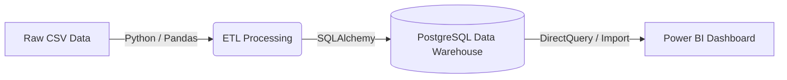

# Data Warehouse Architecture

The architecture follows a standard Kimball Bottom-Up methodology. 
1. **Source Systems:** Raw CSV files ([PKDD'99 Financial Dataset](https://www.kaggle.com/datasets/siavashraz/1999-czech-financial-dataset))
2. **ETL Pipeline:** A Python-based script (`load_real_data.py`) utilizing `pandas` for in-memory transformations, data cleansing, and surrogate key generation.
3. **Data Warehouse:** A PostgreSQL relational database structured for OLAP.
4. **BI/Presentation Layer:** Microsoft Power BI directly connected to the PostgreSQL database for interactive dashboarding.

