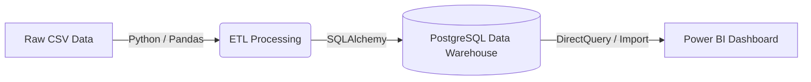
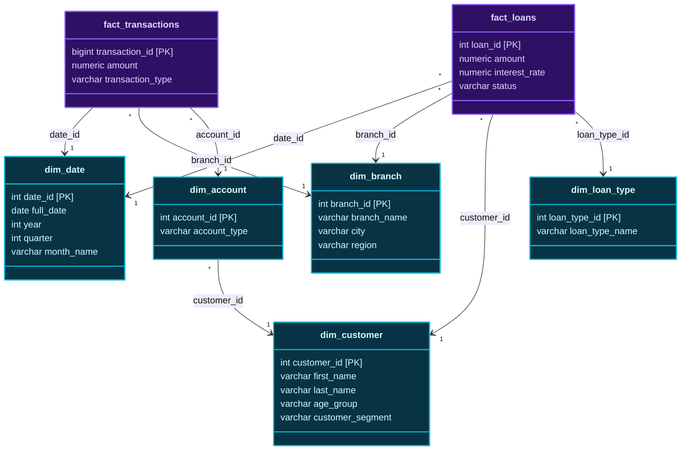

# Banking Analytics Data Warehouse - Final Project Report

This report satisfies the documentation deliverables for the academic data warehouse project, specifically addressing Problem Definition, Requirement Analysis, Source Database Design, Data Warehouse Architecture, and the Final Project Report.

---

## 1. Problem Definition
Modern banking institutions generate massive amounts of transactional and demographic data daily. However, operational databases (OLTP) are optimized for fast inserts and updates, making them highly inefficient for complex analytical queries. 

The objective of this project is to **create a Banking Analytics Data Warehouse** by integrating customer, account, loan, and transaction information. The goal is to design a multidimensional dimensional model (Star/Galaxy schema) that supports rapid Business Intelligence (BI) reporting, enabling management to perform advanced OLAP analysis on branch-wise deposits, loan distribution, customer segmentation, and temporal revenue trends.

---

## 2. Requirement Analysis
To successfully build the data warehouse, the following requirements must be met:
- **Data Integration (ETL):** Extract raw historical banking data (based on the real-world [PKDD'99 Financial Dataset](https://www.kaggle.com/datasets/siavashraz/1999-czech-financial-dataset)), transform it into analytical formats, and load it into a centralized repository.
- **Dimensional Modeling:** The schema must support slicing and dicing across time (dates), geography (branches), and demographics (customers).
- **Metric Calculations:** The system must aggregate total deposits, calculate loan default rates, segment customers by age groups, and track net cash flow.
- **OLAP Capabilities:** The database must support complex analytical functions including `ROLLUP`, `CUBE`, and `Drill-down`.
- **Visualization:** A BI dashboard is required to visually represent the analytical queries to end-users without requiring SQL knowledge.

---

## 3. Source Database Design
The source data mimics a highly normalized operational database consisting of tables for clients, districts, accounts, dispositions (links between clients and accounts), loans, and daily transactions. 

In its raw operational form, querying total deposits for a specific demographic across a specific year would require massive, slow 6-table `JOIN` operations. The source data format was parsed from raw CSV files, mapped, and cleaned before being transitioned into the target Data Warehouse schema.

---

## 5. Data Warehouse Architecture

The architecture follows a standard Kimball Bottom-Up methodology. 
1. **Source Systems:** Raw CSV files (PKDD dataset)
2. **ETL Pipeline:** A Python-based script (`load_real_data.py`) utilizing `pandas` for in-memory transformations, data cleansing, and surrogate key generation.
3. **Data Warehouse:** A PostgreSQL relational database structured for OLAP.
4. **BI/Presentation Layer:** Microsoft Power BI directly connected to the PostgreSQL database for interactive dashboarding.

---

## 6 & 7. Dimensional Modeling (Galaxy Schema)

To accommodate both transaction metrics and loan metrics, a **Galaxy Schema** (a schema with multiple Fact tables sharing conformed dimensions) was implemented.

### Dimensions (Context)
- `dim_date`: Conformed dimension for time-series analysis (Year, Quarter, Month, Day, Weekend flags).
- `dim_branch`: Geographic and organizational hierarchy (Branch Name, City, Region).
- `dim_customer`: Demographic data (Age, Gender, Age Group, Customer Segment).
- `dim_account`: Account metadata (Type, Open Date, Status).
- `dim_loan_type`: Loan categorizations.

### Facts (Measurements)
- `fact_transactions`: Contains exactly 1,056,320 rows. Tracks every deposit and withdrawal event. Grain is at the individual transaction level.
- `fact_loans`: Tracks disbursed loans, their amounts, interest rates, and current status (Active/Closed/Defaulted).

---

## 8 & 9. Data Cube & OLAP Queries
All requirements for OLAP operations have been successfully fulfilled in the `sql/olap_queries.sql` file, which contains **12 distinct analytical queries**, exceeding the minimum requirement of 10. 
- **Roll-up:** Query 1 aggregates deposits dynamically from Month -> Quarter -> Year.
- **Drill-down:** Query 2 steps down from Region -> City -> Branch.
- **Slice & Dice:** Queries 3 and 4 isolate specific quarters, regions, and loan types.
- **Data Cube:** Query 5 leverages the `GROUP BY CUBE` SQL function to generate multidimensional sub-totals and grand totals for transactions across all combinations of branch regions and transaction types.

## 10 & 12. Dashboard and Demonstration
The final deliverable is completed via the Power BI interactive dashboard, successfully connecting to the PostgreSQL instance and rendering visual analytics on the PKDD dataset.
